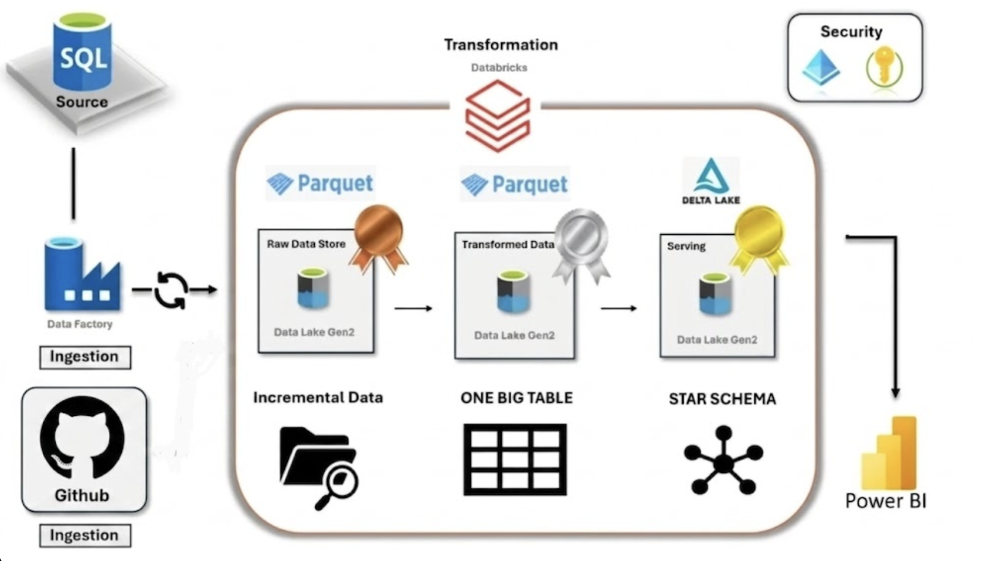
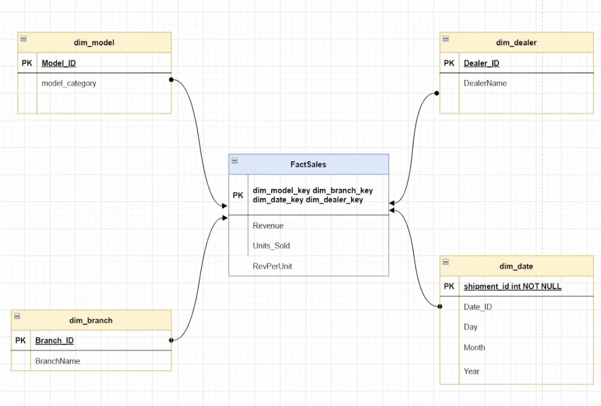

# 🏗️ Architecture & Data Model

This section provides a visual overview of the end-to-end Azure Data Engineering pipeline and the final dimensional data model used for analytics.

---

## 🔷 1. End-to-End Architecture (Medallion Pipeline)

This architecture follows the **Medallion Architecture pattern (Bronze → Silver → Gold)** implemented using Azure services.

### 🔹 Key Flow:
- Data is sourced from GitHub and Azure SQL Database  
- Azure Data Factory (ADF) handles ingestion and orchestration  
- Data is stored in Azure Data Lake Storage (ADLS Gen2)  
- Azure Databricks performs transformation using PySpark  
- Final Gold layer is structured as a Star Schema  
- Power BI is used for visualization  

### 🧠 Architecture Diagram:

---

## 🔶 2. Data Model (Star Schema Design)

The final analytical layer is designed using a **Star Schema model**, optimized for reporting and BI workloads.

### 🔹 Components:

#### Fact Table:
- `FactSales`
- Contains measurable business metrics:
  - Revenue  
  - Units Sold  
  - Revenue per Unit  

#### Dimension Tables:
- `dim_model` → Product/model details  
- `dim_dealer` → Dealer information  
- `dim_branch` → Branch/store details  
- `dim_date` → Time dimension (Day, Month, Year)  

### 🔹 Relationships:
- Fact table is connected to all dimension tables using foreign keys  
- Enables efficient analytical querying and aggregation  

### 🧠 Data Model Diagram:

---

## 📌 Summary

This project uses:

- Medallion Architecture for data layering  
- Azure Data Factory for ingestion and orchestration  
- Azure Databricks for transformation  
- Star Schema for optimized analytics  

Together, they form a **scalable, production-style data engineering pipeline**.
